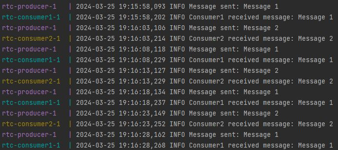

# Тестовое задание для Ростелеком
Сделать docker-compose файл при помощи которого командой docker-compose up будет подниматься ApacheKafka и 3 сервиса на python. 
Первый сервис будет с интервалом в 5 секунд посылать в ApacheKafka сообщение. А второй и третий сервисы это копия одного и того же сервиса которые будут подписаны на сообщения от первого, и будут ПО ОЧЕРЕДИ получать сообщения и выводит в логи, в консоль, имя сервиса получившего сообщение и получение сообщения. 
В качестве клиента к ApacheKafka использовать библиотеку aiokafka.

 
### клонируем 

    git clone https://github.com/se-andrey/RTC.git

### запуск

Если на сервере нет docker/docker-compose, то установите его - инструкция https://docs.docker.com/

Для запуска:

    docker-compose up --build 

Для остановки:

    docker-compose down -v

### пример

